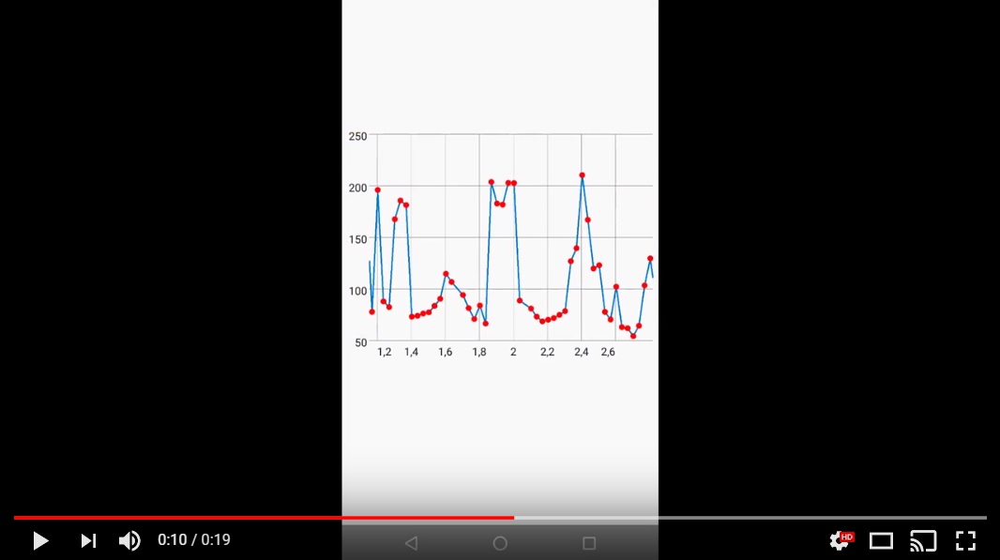

# AngleBike
Proyecto del trabajo de fin de grado 'Analisis Biomecanico para ciclistas' creado por Carlos Jaynor Marquez Torres, Laura Perez Jambrina, Daniel Tocino Estrada.

## Video con angulos

## Grafico de los angulos

